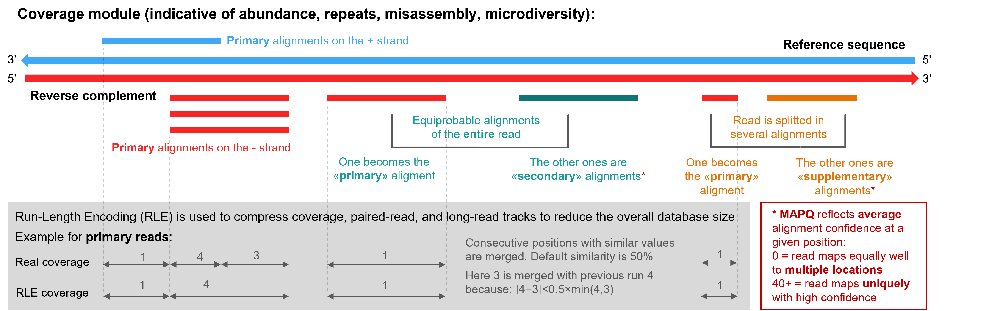
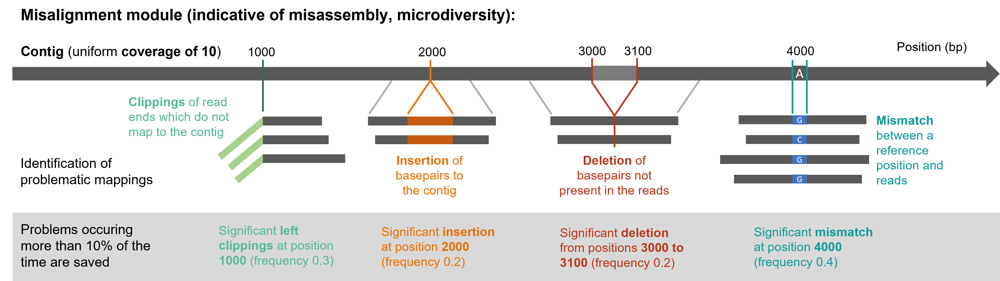
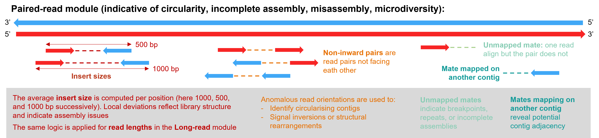

# # Computed features

This document describes all features computed from the mapping files by theBIGbam and stored in the DuckDB database. Most features are defined by the SAM/BAM standard and documented in the [SAM specification](https://samtools.github.io/hts-specs/SAMv1.pdf). You can consult it for additional information.

Features are organized by **module** as they appear in the visualization interface. Within a module, each subplot displays 1 or 2 features that are plotted together.

In addition, genomic features are stored when an optional annotation file is provided.

---

## Coverage module

Features describing read alignment depth and quality across the genome.



| Subplot              | Feature               | Description                                                                                                                                                                                                                                                                         | Use case                                                                                                          |
| -------------------- | --------------------- | ----------------------------------------------------------------------------------------------------------------------------------------------------------------------------------------------------------------------------------------------------------------------------------- | ----------------------------------------------------------------------------------------------------------------- |
| Primary alignments   | Primary reads         | The number of reads covering each position, counting only primary alignments                                                                                                                                                                                                        |                                                                                                                   |
| Alignments by strand | Strand + and strand - | Separation of primary alignments by strand (+ and -)                                                                                                                                                                                                                                | Strand bias can indicate certain library preparation artifacts or biological features like transcription          |
| Other alignments     | Secondary             | Reads flagged as secondary (SAM flag 0x100) - alternative alignments when a read maps to multiple locations                                                                                                                                                                         | High secondary alignment counts indicate repetitive or ambiguous regions where reads could map to multiple places |
| Other alignments     | Supplementary         | Reads flagged as supplementary (SAM flag 0x800) - chimeric alignments where different parts of the read map to different locations                                                                                                                                                  | High supplementary counts may indicate structural variants, chimeric sequences, or assembly errors                |
| MAPQ                 | MAPQ                  | Average confidence of read alignments at each position. **Warning:** MAPQ scoring varies between aligners (BWA, Bowtie2, minimap2, etc.), See this [blog](https://sequencing.qcfail.com/articles/mapq-values-are-really-useful-but-their-implementation-is-a-mess/) for more detail | Evaluate alignment confidence variability                                                                         |

**Warning:** Secondary reads and MAPQ are not realiable when using thebigbam mapping with `--circular`  option. Because this option doubles the contig length during mapping, reads that do not span the contig junction can map equally well to two positions. This results in an artificially high number of secondary alignments and reduced MAPQ values.

---

## Misalignment module

Features describing alignment anomalies that may indicate assembly issues or microdiversity.

 

| Subplot    | Feature                  | Description                                                                                                                                                                                                                                                                                                                                                 | Use case                                                                                                                                                                                                                                                                      |
| ---------- | ------------------------ | ----------------------------------------------------------------------------------------------------------------------------------------------------------------------------------------------------------------------------------------------------------------------------------------------------------------------------------------------------------- | ----------------------------------------------------------------------------------------------------------------------------------------------------------------------------------------------------------------------------------------------------------------------------- |
| Clippings  | Left and right clippings | Soft/hard clipping occurs when part of a read does not align to the reference. The clipped portion represents sequence in the read that has no corresponding match in the reference. At each position, reads with soft/hard clipping at their left (5') and right (3') end are counted, along with mean, median, and standard deviation of clipping lengths | Indicates sequence present in reads but missing from the left or right side of the reference at this position. Common at contig ends if the assembly is incomplete. **Warning:** can also be caused by adapter contamination be certain your reads were properly preprocessed |
| Indels     | Insertions               | Sequence present in the reference but absent from reads. Determined from 'I' operations in CIGAR strings. Mean, median, and standard deviation of insertion lengths are also determined                                                                                                                                                                     | Could indicate true insertions in the sequenced sample, missing sequence in the reference assembly, sequencing errors (especially in homopolymer regions)                                                                                                                     |
| Indels     | Deletions                | Sequence present in the reference but absent from reads. Determined from 'D' operations in CIGAR strings.                                                                                                                                                                                                                                                   | Could indicate true deletions in the sequenced sample, extra sequence incorrectly included in the reference, alignment artifacts                                                                                                                                              |
| Mismatches | Mismatches               | Count of base substitutions at each position. Computed from from the MD tag in BAM files, count positions where the read base differs from the reference base                                                                                                                                                                                               | SNPs (true variation between sample and reference), sequencing errors, alignment errors in repetitive regions                                                                                                                                                                 |

---

## Long-reads module

Features specific to long-read sequencing data (PacBio, Nanopore).

| Subplot      | Feature      | Description                                    | Use case                                                                                                                                |
| ------------ | ------------ | ---------------------------------------------- | --------------------------------------------------------------------------------------------------------------------------------------- |
| Read lengths | Read lengths | Average length of reads covering each position | Identify regions covered by shorter or longer reads. Unusually short reads in a region might indicate fragmentation or alignment issues |

---

## Paired-reads module

Features specific to paired-end/mate-pair sequencing data (Illumina).



| Subplot          | Feature                | Description                                                                                                                    | Use case                                                                                                                                                    |
| ---------------- | ---------------------- | ------------------------------------------------------------------------------------------------------------------------------ | ----------------------------------------------------------------------------------------------------------------------------------------------------------- |
| Insert sizes     | Insert sizes           | Average distance between read pairs at each position                                                                           | Consistent insert sizes indicate normal library structure. Deviations from the expected insert size may indicate structural variants (insertions/deletions) |
| Non-inward pairs | Non-inward pairs       | Count reads where the mate maps to the same contig but the pair orientation is not the expected inward-facing (FR) orientation | High counts suggest inversions in the sample relative to the reference, tandem duplications, assembly errors                                                |
| Mate not mapped  | Unmapped mates         | Count reads where the mate unmapped flag (0x8) is set                                                                          | High counts may indicate sequence not present in the reference, poor quality mate reads, contamination in the library                                       |
| Mate not mapped  | Mate on another contig | Count reads where the mate reference ID differs from the read's reference ID                                                   | Can indicate chimeric molecules in the library, misassemblies where contigs should be joined, mobile elements or prophages integrated at this position      |

---

## Termini Module

Features designed for detecting phage DNA packaging sites and terminus types. These are particularly useful for analyzing bacteriophage genomes.

(see the [PhageTerm publication](https://www.nature.com/articles/s41598-017-07910-5))

### Subplot: Reads Termini

| Subplot       | Feature                    | Description                                                                                                                             | Use case                                                                                                                                                    |
| ------------- | -------------------------- | --------------------------------------------------------------------------------------------------------------------------------------- | ----------------------------------------------------------------------------------------------------------------------------------------------------------- |
| Reads termini | Read starts and reads ends | These features count where reads start and end, which can reveal DNA packaging cut sites. Count of read 5' and 3' ends at each position | Consistent insert sizes indicate normal library structure. Deviations from the expected insert size may indicate structural variants (insertions/deletions) |

These features count where reads start and end, which can reveal DNA packaging cut sites.

#### Read Starts

- **Description:** Count of read 5' ends at each position
- **How it's computed:** Count how many reads have their first aligned base at each position. For paired-end data, uses strand-aware logic to identify true 5' ends
- **Interpretation:** Peaks indicate positions where DNA molecules frequently begin, which may represent:
  - Phage packaging initiation sites
  - DNA cutting/fragmentation sites
  - For random fragmentation (most libraries), should be relatively uniform

#### Read Ends

- **Description:** Count of read 3' ends at each position
- **How it's computed:** Count how many reads have their last aligned base at each position
- **Interpretation:** Peaks indicate positions where DNA molecules frequently end. Combined with Read Starts, helps identify terminus types

### Subplot: Coverage Reduced

#### Coverage Reduced

- **Description:** Coverage counting only "clean" reads without clipping or mismatches at their ends
- **How it's computed:** Count reads that:
  - Start with an exact match (no 5' clipping or mismatch)
  - For long reads: also end with an exact match
- **Use case:** Provides cleaner signal for terminus detection by excluding reads with noisy ends that could obscure true packaging sites
- **Display:** Shown as a continuous curve

### Subplot: Tau

#### Tau (τ)

- **Description:** Normalized measure of read terminus enrichment relative to coverage

- **How it's computed:**
  
  ```
  τ = (Read Starts + Read Ends) / Coverage Reduced
  ```
  
  Averaged over the positions in each compressed data run

- **Value range:** 0 to ~2 (can exceed 2 at very sharp termini)

- **Interpretation:**
  
  - **τ ≈ 0:** Few read termini relative to coverage (typical for internal regions)
  - **τ > 0.5:** Enrichment of read termini, suggesting a potential packaging site
  - **τ approaching 2:** Very strong terminus signal (both starts and ends enriched)

- **Use case:** Tau normalizes terminus counts by coverage, making it easier to identify true packaging sites that would otherwise be obscured by coverage variation

---

## Genome module

Features describing intrinsic genomic properties, independent of sequencing data. These are computed when an annotation file (`-g`) or assembly file (`-a`) is provided.

| Subplot | Feature          | Description                                                                                                                                                                                 | Use case                                                                                                                                                          |
| ------- | ---------------- | ------------------------------------------------------------------------------------------------------------------------------------------------------------------------------------------- | ----------------------------------------------------------------------------------------------------------------------------------------------------------------- |
| Repeats | Direct repeats   | Regions of the genome that are repeated in the same orientation. Detected by self-BLAST of the contig sequence, identifying segments that appear multiple times in the same 5'→3' direction | Terminal direct repeats (DTR) are characteristic of certain phage packaging mechanisms. Internal direct repeats may indicate mobile elements or gene duplications |
| Repeats | Inverted repeats | Regions of the genome that are repeated in opposite orientations. Detected by self-BLAST, identifying segments where one copy is the reverse complement of another                          | Inverted terminal repeats (ITR) are found in certain phages and transposons. Internal inverted repeats can form secondary structures (hairpins)                   |

## Database Storage Notes

- All feature values are stored as **INTEGER** in DuckDB for efficient compression
- **Tau** and **MAPQ** values are stored multiplied by 100 (e.g., τ=0.75 stored as 75)
- Features with length statistics (clippings, insertions) include additional **Mean**, **Median**, and **Std** columns
- The **Variable** table contains metadata for each feature including display properties (color, plot type, module assignment)

---

## See Also

- [Assembly Check Metrics](ASSEMBLY_CHECK.md) - Filtering metrics based on these features
- [Phage Packaging](PHAGE_PACKAGING.md) - How packaging mechanisms are detected from terminus patterns
