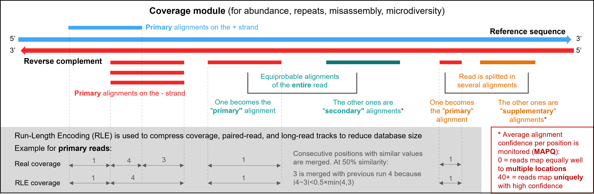
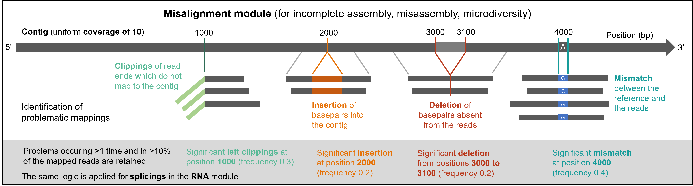
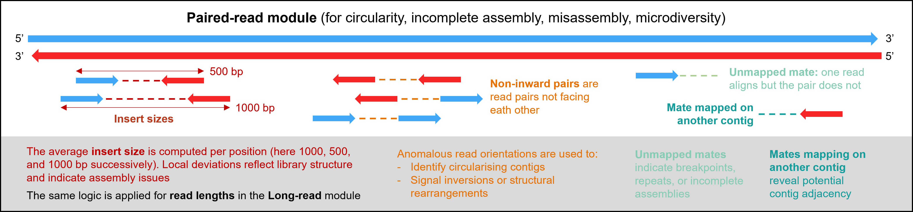
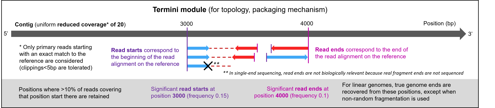

# Computed features

This document describes all features computed from the input files by theBIGbam and stored in the DuckDB database. Features are organized by **module** as they appear in the visualization interface. Within a module, each subplot displays 1 or 2 features that are plotted together.

6 modules comprise mapping-derived features. Most of them are defined by the SAM/BAM standard and documented in the [SAM specification](https://samtools.github.io/hts-specs/SAMv1.pdf). You can consult it for additional information.

1 additional module comprises genomic features computed from the annotation or assembly file provided.

---

## Coverage module

Features describing read alignment depth and quality across the genome.

| Subplot              | Feature        | Description                                                                                                                        | Use case                                                             |
|:-------------------- | -------------- | ---------------------------------------------------------------------------------------------------------------------------------- | -------------------------------------------------------------------- |
| Primary alignments   | Primary reads  | The number of reads covering each position, counting only primary alignments                                                       | Abundance per position                                               |
| Alignments by strand | Strand + and - | Separation of primary alignments by strand (+ and -)                                                                               | Library preparation, amplification, sequencing, or mapping artifacts |
| Other alignments     | Secondary      | Reads flagged as secondary (SAM flag 0x100) - alternative alignments when a read maps to multiple locations                        | Repetitive or ambiguous regions                                      |
| Other alignments     | Supplementary  | Reads flagged as supplementary (SAM flag 0x800) - chimeric alignments where different parts of the read map to different locations | Structural variants, chimeric sequences                              |
| MAPQ                 | MAPQ           | Average confidence of read alignments at each position. See the **warning** below though                                           | Filtering reads                                                      |

**Warning:** MAPQ scoring varies between aligners (BWA, Bowtie2, minimap2, etc.), See this [blog](https://sequencing.qcfail.com/articles/mapq-values-are-really-useful-but-their-implementation-is-a-mess/) for more detail. Also MAPQ are not reliable when using thebigbam mapping with `--circular`  option. See [On mapping with circular genome support](CIRCULAR_MAPPING.md) for details.

---

## Misalignment module

Features describing alignment anomalies that may indicate assembly issues or microdiversity.

 

| Subplot    | Feature                  | Description                                                                                                                                                                                                                                                                                                                                                                                                           | Use case                                                                                                                                                                                                                                                                    |
| ---------- | ------------------------ | --------------------------------------------------------------------------------------------------------------------------------------------------------------------------------------------------------------------------------------------------------------------------------------------------------------------------------------------------------------------------------------------------------------------- | --------------------------------------------------------------------------------------------------------------------------------------------------------------------------------------------------------------------------------------------------------------------------- |
| Clippings  | Left and right clippings | Soft/hard clipping occurs when part of a read does not align to the reference. The clipped portion represents sequence in the read that has no corresponding match in the reference. At each position, reads with soft/hard clipping at their left (5') and right (3') end are counted, along with mean, median, and standard deviation of clipping lengths. The dominant clipping sequence is recorded (first 20 bp) | Indicates sequence present in reads but missing from the left or right side of the reference at this position. Common at contig ends if the assembly is incomplete. **Warning:** can also be caused by adapter contamination so check your reads were properly preprocessed |
| Indels     | Insertions               | Sequence present in the reference but absent from reads. Determined from 'I' operations in CIGAR strings. Mean, median, and standard deviation of insertion lengths are also determined. The dominant insertion is recorded (main variant)                                                                                                                                                                            | Could indicate true insertions in the sequenced sample, missing sequence in the reference assembly, sequencing errors (especially in homopolymer regions)                                                                                                                   |
| Indels     | Deletions                | Sequence present in the reference but absent from reads. Determined from 'D' operations in CIGAR strings                                                                                                                                                                                                                                                                                                              | Could indicate true deletions in the sequenced sample, extra sequence incorrectly included in the reference, alignment artifacts                                                                                                                                            |
| Mismatches | Mismatches               | Count of base substitutions at each position. Computed from from the MD tag in BAM files, count positions where the read base differs from the reference base. The dominant mismatch  is recorded (main variant) along with the change category (*synonymous*, *non-synonymous*, *intergenic) and the resulting amino acid. See the **warning** below though                                                          | SNPs (true variation between sample and reference), sequencing errors, alignment errors in repetitive regions                                                                                                                                                               |

**Warning:** Each mismatch position is evaluated independently. If two mismatches occur within the same codon and are carried by the same read (e.g., two adjacent SNPs), the tool analyzes each position separately rather than reconstructing the combined mutant codon. As a result, the reported variant codon and amino acid may occasionally be incorrect. For example, a codon containing two SNPs could be interpreted as two independent single-base substitutions instead of one double-mutant codon. In our experience, such cases are extremely rare though.

---

## RNA module

Features specific to RNA sequencing data. It only applies to RNA-aware alignment data produced by tools like STAR or HISAT2.

| Subplot   | Feature   | Description                                                                           | Use case                                       |
| --------- | --------- | ------------------------------------------------------------------------------------- | ---------------------------------------------- |
| Splicings | Splicings | Sequence absent from RNA transcripts. Determined from 'N' operations in CIGAR strings | Differentiate introns from exons, and isoforms |

---

## Paired-reads module

Features specific to paired-end/mate-pair sequencing data (Illumina).

| Subplot          | Feature                | Description                                                                                                                    | Use case                                                                                                                                                    |
| ---------------- | ---------------------- | ------------------------------------------------------------------------------------------------------------------------------ | ----------------------------------------------------------------------------------------------------------------------------------------------------------- |
| Insert sizes     | Insert sizes           | Average distance between read pairs at each position                                                                           | Consistent insert sizes indicate normal library structure. Deviations from the expected insert size may indicate structural variants (insertions/deletions) |
| Non-inward pairs | Non-inward pairs       | Count reads where the mate maps to the same contig but the pair orientation is not the expected inward-facing (FR) orientation | High counts suggest inversions in the sample relative to the reference, tandem duplications, assembly errors                                                |
| Mate not mapped  | Unmapped mates         | Count reads where the mate unmapped flag (0x8) is set                                                                          | High counts may indicate sequence not present in the reference, poor quality mate reads, contamination in the library                                       |
| Mate not mapped  | Mate on another contig | Count reads where the mate reference ID differs from the read's reference ID                                                   | Can indicate chimeric molecules in the library, misassemblies where contigs should be joined, mobile elements or prophages integrated at this position      |

---

## Long-reads module

Features specific to long-read sequencing data (PacBio, Nanopore).

| Subplot      | Feature      | Description                                    | Use case                                                                                                                                |
| ------------ | ------------ | ---------------------------------------------- | --------------------------------------------------------------------------------------------------------------------------------------- |
| Read lengths | Read lengths | Average length of reads covering each position | Identify regions covered by shorter or longer reads. Unusually short reads in a region might indicate fragmentation or alignment issues |

---

## Termini module

Features dedicated to the start and end positions of read alignments. Those positions are useful for analyzing bacteriophage pachaging mechanisms (see the [PhageTerm publication](https://www.nature.com/articles/s41598-017-07910-5) for the methods).

| Subplot          | Feature                    | Description                                                                                                                         | Use case                                                                                                                                        |
| ---------------- | -------------------------- | ----------------------------------------------------------------------------------------------------------------------------------- | ----------------------------------------------------------------------------------------------------------------------------------------------- |
| Coverage Reduced | Coverage Reduced           | Coverage counting only primary reads starting with a match (clippings smaller than 5 bp are tolerated)                              | Provides cleaner signal for terminus detection by excluding reads with noisy ends that could obscure true packaging sites                       |
| Reads termini    | Read starts and reads ends | Count how many read alignments start/end per position among reads kept by "Coverage reduced" (ie read 5' and 3' ends, respectively) | Positions where many reads start/end may correspond to a real termini of the genome (or a misassembly). Also suggests a linear genomic topology |

---

## Genome module

Features describing intrinsic genomic properties, independent of read alignments. These are computed when an annotation file (`-g`) or assembly file (`-a`) is provided.

| Subplot    | Feature             | Description                                                                                                                                                                    | Use case                                                                                                                                                          |
| ---------- | ------------------- | ------------------------------------------------------------------------------------------------------------------------------------------------------------------------------ | ----------------------------------------------------------------------------------------------------------------------------------------------------------------- |
| GC content | GC content          | Proportion of nucleotides that are Guanine or Cytosine. Calculated over 500 bp windows                                                                                         | Detection of Horizontal Gene Transfer (HGT) with regions with different GC content. Assessment of sequencing and assembly quality                                 |
| GC skew    | GC skew             | Imbalance between G and C: *(G-C)/(G+C)*.  Calculated over 1 kbp windows                                                                                                       | A sudden switch may indicate replicating origin or assembly issues                                                                                                |
| Repeats    | Direct repeats*     | Regions of the contig that are repeated in the same orientation. Detected by BLAST self-alignment, identifying segments that appear multiple times in the same 5'→3' direction | Internal direct repeats may indicate mobile elements or gene duplications. Terminal direct repeats (DTR) are characteristic of certain phage packaging mechanisms |
| Repeats    | Inverted repeats*   | Regions of the contig that are repeated in opposite orientations (one copy is the reverse complement of another).                                                              | Inverted terminal repeats (ITR) are found in certain phages and transposons. Internal inverted repeats can form secondary structures (hairpins)                   |
| Repeats    | Repeats within MAG* | Regions of the contig repeated in another contig from the same MAG (valid only in MAG view)                                                                                    | For mobile elements or gene duplications                                                                                                                          |

\* For each position, the number of repeats and the hit with maximal identity (%) comprising this position are recorded
