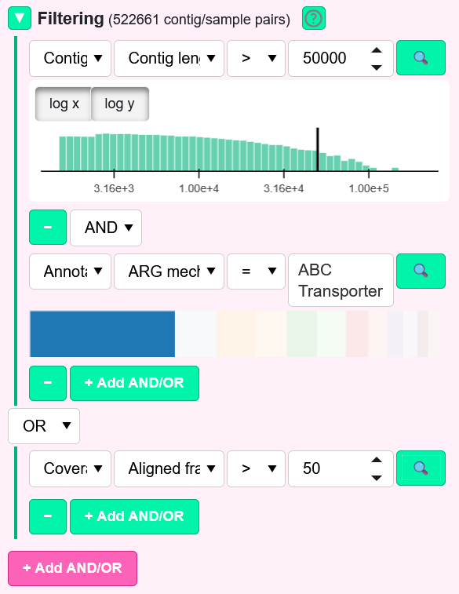

# Filtering logic

The Filtering section lets you build complex queries to narrow down which contig/sample pairs are displayed in your plots.

Each filter row consists of:

- A **category** of metric: Contig, Annotations, Sample, Coverage, Misassembly, Microdiversity, Side misassembly, Topology, or Termini. For a MAG database, additional categories MAG, "MAG coverage", "MAG Misassembly" and "MAG Microdiversity" exists

- A **metric** within that category: examples "Contig length" for Contig, "Coverage mean" for Coverage, "Sequencing type" for Sample

- A **comparison operator**: "=", "!=", ">" and "<" for numeric columns, "=", "!=", "has", "has not" for text columns

- An **input value**: a numeric value for numeric columns, or a text value for other columns. For text inputs, a list of values used in the database is provided as suggestions

- A **magnifying glass** button to see the distribution of values for this metric in the database

The row value contains a **"-" button** to remove the previous filter row and a "+ Add AND/OR" green button to add a new **connector** and a new **filter row**. You can choose whether the logical operator is **AND** or **OR**. Multiple conditions within a section are visually grouped by a green bar on the left. Multiple sections can be added using the pink "+ Add AND/OR" button.

Once your filters are set, the list of contigs and samples proposed in their respective sections is updated. In addition, only matching pairs will appear in the generated plots. This is particularly useful for focusing your analysis on subsets of interest, such as high-coverage contigs, specific packaging mechanisms, or contigs meeting completeness thresholds.

For MAG databases, the MAG and contig filters in the Filtering panel affect the list of MAGs displayed in the **MAGs** section. Only MAGs containing at least one contig passing the contig filters are included in the MAG list. Only contigs belonging to a MAG passing the MAG filters are included in the contig list.

For example, the example above is equivalent to the condition:

*(Contig_length > 50kbp AND ARG_mechanism = "ABC transporter") OR (Aligned_fraction > 50%)*

In the Contigs section, the tool proposes contigs that are long enough and harbor at least one ABC transporter. Contigs with an aligned fraction exceeding 50% are also included. The MAGs containing these contigs are reported, together with the samples in which these MAGs are present.

# Contig/MAG filters

## Contig

Those metrics are available only if a Genbank file was provided (or at least an assembly file for some of them).

| Metric                       | Definition                                                                                                              |
| ---------------------------- | ----------------------------------------------------------------------------------------------------------------------- |
| Contig length                | Length of the contig sequence, in base pairs (bp)                                                                       |
| Duplication (%)              | Proportion of the contig covered by repeats (calculated from BLAST self-alignment)                                      |
| GC mean                      | Mean GC content (%) calculated across the contig using non-overlapping 500 bp sliding windows                           |
| GC sd                        | Standard deviation of GC content                                                                                        |
| GC skew amplitude            | Amplitude of GC skew, i.e. *max(GC skew) - min(GC skew)*, calculated across non-overlapping 1 kbp sliding windows       |
| Positive GC skew windows (%) | % of the 1 kbp windows with positive GC skew                                                                            |
| Number of samples            | Number of samples where this contig is present. In a MAG database, this field is associated to the MAG section instead. |

In MAG databases, the same metrics are available in the **MAG category** with 2 additional metrics for the:

## Annotations

All qualifiers extracted from the annotation files during the calculate operation can be used to identify subsets with contigs of interest. In the example above, we mapped a collection of MAGs from multiple river metagenomes and generated a database from the resulting alignments. We were specifically interested in antimicrobial resistance genes (ARGs) present in these metagenomes. These genes were identified using hmmscan and the Resfams HMM models. The resulting annotations were then merged into the Bakta-generated GenBank files as described in [Use case 3](docs/USAGE.md#use-case-3-large-dataset-3000-mags-192-samples). Once incorporated into the database, these annotations can be used in the Filtering section to select only contigs harboring ARGs associated with specific resistance mechanisms, as illustrated in the example above.

# Sample filters

| Metric                 | Definition                                                                               |
| ---------------------- | ---------------------------------------------------------------------------------------- |
| Sequencing_type        | Type of sequencing technology used for the sample (long, paired-short, single-short)     |
| Number_of_reads        | Total number of sequencing reads generated for the sample                                |
| Number_of_mapped_reads | Number of sequencing reads that successfully map to the contigs                          |
| Circular mapping       | Whether the mapping of this samples was done using the circular done of theBIGbam or not |

Additional columns might be available depending on the information you added per sample using *thebigbam add-sample-metadata* command.

# Contig/sample pairs filters

## Coverage

| Metric                                 | Definition                                                                                                                                                                                                                                                                                                                                 |
| -------------------------------------- | ------------------------------------------------------------------------------------------------------------------------------------------------------------------------------------------------------------------------------------------------------------------------------------------------------------------------------------------ |
| Aligned fraction (%)                   | % of the contig length covered by at least one mapped read                                                                                                                                                                                                                                                                                 |
| Expected aligned fraction              | Expected aligned fraction given the coverage depth, using the definition from [inStrain](https://pmc.ncbi.nlm.nih.gov/articles/PMC9223867/): $-e^{0.883 \cdot \mathrm{coverage}} + 1$. An aligned fraction significantly lower than this number should be questioned                                                                       |
| Read count                             | Number of reads mapping to this contig for this sample                                                                                                                                                                                                                                                                                     |
| Coverage mean                          | Mean number of reads mapping per position                                                                                                                                                                                                                                                                                                  |
| Coverage median                        | Median number of reads mapping per position                                                                                                                                                                                                                                                                                                |
| Coverage trimmed mean                  | Trimmed mean coverage (taking the mean number of reads per position after excluding the 5% least and most covered positions)                                                                                                                                                                                                               |
| Coverage coefficient of variation (CV) | Measures global dispersion around the mean: *CV = sqrt( sum( (Coverage[i] - Mean_coverage)^2 ) / n ) / Mean_coverage*. A CV of 0 means uniform coverage ; higher values mean CV is more spread around the mean                                                                                                                             |
| Relative coverage roughness (CR)       | Measures local coverage smoothness: *CR = sqrt( sum( (Coverage[i+1] - Coverage[i])^2 ) / (n-1) ) / Mean_coverage*. A low value means gradual changes, a high value means sharp jumps                                                                                                                                                       |
| RPKM                                   | Reads Per Kilobase per Million mapped reads. Normalizes coverage for both feature length and sequencing depth, allowing comparisons across samples                                                                                                                                                                                         |
| TPM                                    | Transcripts Per Million, as described in [Li et al., 2010](https://academic.oup.com/bioinformatics/article/26/4/493/243395). Like RPKM, it normalizes for feature length and sequencing depth, but values are scaled so that the sum of TPMs in each sample equals 1,000,000, making relative abundances easier to compare between samples |

The **MAG coverage category** contains the same metrics but averaged over an entire MAG.

## Misassembly

The [Misalignment module](docs/FEATURES.md#misalignment-module) flags positions where mapped reads diverge substantially from the reference. Discrepancies supported by more than 50% of locally aligned reads can reflect misassemblies when they occur in the sample from which the contig was assembled. Those metrics count the abundance of discrepancies with **>= 50% prevalence**.

| Metric                 | Definition                                                                                                                                                                                                                                                                                                                                                                                                   |
| ---------------------- | ------------------------------------------------------------------------------------------------------------------------------------------------------------------------------------------------------------------------------------------------------------------------------------------------------------------------------------------------------------------------------------------------------------ |
| Mismatches per 100 kbp | Number of positions with mismatch prevalence >= 50% per 100 kbp                                                                                                                                                                                                                                                                                                                                              |
| Deletions per 100 kbp  | Number of positions with deletion prevalence >= 50% per 100 kbp                                                                                                                                                                                                                                                                                                                                              |
| Insertions per 100 kbp | Number of positions with insertion prevalence >= 50% per 100 kbp                                                                                                                                                                                                                                                                                                                                             |
| Clippings per 100 kbp  | Number of positions with clipping prevalence >= 50% per 100 kbp                                                                                                                                                                                                                                                                                                                                              |
| Collapse bp            | Bases present in reads but missing from reference (insertion + clippings + mismatches at >= 50% prevalence). For insertions and clippings, the contribution is the median length of the insertion/clipping event                                                                                                                                                                                             |
| Collapse per 100 kbp   | Collapse bp per 100 kbp                                                                                                                                                                                                                                                                                                                                                                                      |
| Expansion bp           | Bases present in reference but missing from reads (deletions + mismatches + paired clippings at >= 50% prevalence). For deletions, the contribution is the median length of the deletion event. For paired clippings, the contribution is the distance between a right-clip position and the next downstream left-clip position, provided that both clipping positions occur at a prevalence of at least 50% |
| Expansion per 100 kbp  | Expansion bp per 100 kbp                                                                                                                                                                                                                                                                                                                                                                                     |

The **MAG misassembly category** contains the same metrics but averaged over an entire MAG.

**Warnings regarding the collapse metrics calculated for the misassembly, microdiversity and side misassembly categories:**

- Collapse metrics tend to **underestimate the incompleteness of the contig**, especially when using short reads, because short reads cannot extend far beyond the last properly assembled base.

- For circular contigs, collapse metrics can sometimes **overestimate missing sequence**. This typically occurs when mappings are performed without theBIGbam or without the `--circular` option, **because reads that would normally span the junction between the last and first contig positions are clipped: standard mappers do not support circular alignments**.

- In **rare cases**, this effect can also occur for long reads even when the `--circular` option is used. For example, in bacteriophages, single long reads may contain multiple full viral genomes due to concatemers. In such cases, only the portion of the read corresponding to one contig length (or up to twice the contig length when mapping with theBIGbam and the `--circular` option) is mapped, and the remaining sequence is clipped. If many concatemer-derived long reads are present, collapse metrics may detect this clipped signal, leading to artificially high estimates of missing sequence.

## Microdiversity

Same logic as the Misassembly metrics but with a **>= 10% prevalence** threshold, capturing lower-frequency variants. These positions may reflect subpopulations missing a segment of the contig (reads with deletions) or carrying an extra segment (reads with insertions, clippings).

In addition to Mismatches/Deletions/Insertions/Clippings per 100 kbp, you have:

| Metric                                   | Definition                                                                                       |
| ---------------------------------------- | ------------------------------------------------------------------------------------------------ |
| Microdiverse bp on reads                 | Bases present in reads but not in reference. Calculated as Collapse bp but at >= 10% prevalence  |
| Microdiverse bp per 100 kbp on reads     | Microdiverse bp on reads per 100 kbp                                                             |
| Microdiverse bp on reference             | Bases present in reference but not in reads. Calculated as Expansion bp but at >= 10% prevalence |
| Microdiverse bp per 100 kbp on reference | Microdiverse bp on reference per 100 kbp                                                         |

The **MAG microdiversity category** contains the same metrics but averaged over an entire MAG.

## Side misassembly

Evaluates completeness at contig extremities based on significant clipping events (>= 50% prevalence) where the median clipped length extends beyond the contig boundary.

| Metric                               | Definition                                                                                                                        |
| ------------------------------------ | --------------------------------------------------------------------------------------------------------------------------------- |
| Coverage first position              | Primary read coverage at the first position of the contig                                                                         |
| Contig start collapse prevalence     | Prevalence of the terminal left-clipping event (clippings / local coverage), i.e. fraction of reads that are clipped at the start |
| Contig start collapse bp             | Median clipped length at the terminal left-clipping event (estimated missing sequence at start)                                   |
| Contig start expansion bp            | Distance from the terminal left-clipping event to the contig start (contamination length at start)                                |
| Coverage last position               | Raw coverage (read depth) at the last position of the contig                                                                      |
| Contig end collapse prevalence       | Prevalence of the terminal right-clipping event (clippings / local coverage), i.e. fraction of reads that are clipped at the end  |
| Contig end collapse bp               | Median clipped length at the terminal right-clipping event (estimated missing sequence at end)                                    |
| Contig end expansion bp              | Distance from the terminal right-clipping event to the contig end (contamination length at end)                                   |
| Contig end misjoint mates            | Number of read pairs where one mate maps to the contig end and the other maps to a different contig (paired-read only)            |
| Normalized contig end misjoint mates | Contig end misjoint mates normalized by coverage mean (paired-read only)                                                          |

## Topology

Evaluates the circularity of contigs. The first 3 metrics are available for mappings performed with `thebigbam mapping-per-sample --circular` mode. The last 3 metrics are available for paired-reads only.

| Metric                              | Definition                                                                                                                                                                                                               |
| ----------------------------------- | ------------------------------------------------------------------------------------------------------------------------------------------------------------------------------------------------------------------------ |
| Circularising reads                 | Number of reads whose alignment starts near the end of the contig and continues past the contig start (circular mapping only)                                                                                            |
| Circularising reads prevalence      | Circularising reads divided by the mean coverage at the first and last contig positions (circular mapping only)                                                                                                          |
| Median circularising len            | For each circularising read, the shorter side of the overlap is considered (either bases mapped on the start of the contig or on the end). The median len of those min-overlaps is computed here (circular mapping only) |
| Circularising inserts               | Number of read pairs spanning the junction between contig end and start. One member of the pair maps towards the contig start, the other member towards the contig end (paired-read only)                                |
| Circularising insert size deviation | Median insert size of circularising pairs minus median insert size of all proper pairs (paired-read only)                                                                                                                |
| Normalized circularising inserts    | Circularising insert sizes normalized by coverage mean (paired-read only)                                                                                                                                                |

An approximate estimate of the first 3 metrics could be calculated without the `thebigbam mapping-per-sample --circular` mode, using supplementary alignments spanning both contig ends and, for paired-end short reads, non-inward read pairs with reasonable insert sizes mapping to both contig ends. However, this approach does not provide an exact estimation of circularity compared to circular mapping with the `--circular` option. For this reason, we do not provide those estimates.

## Termini

Phage packaging mechanism detection based on terminus analysis. In sequencing libraries prepared by random fragmentation of DNA, read starts accumulate at natural genome termini because these positions are overrepresented compared to randomly generated fragment ends. This enrichment allows the precise identification of contig termini. In the particular case of bacteriophages, the number, orientation, and relative positions of detected termini can be used to infer the phage DNA packaging mechanism. The [classification protocol](docs/PHAGE_PACKAGING.md) mostly follows the rules implemented by the [PhageTerm software](https://www.nature.com/articles/s41598-017-07910-5).

| Metric                         | Definition                                                                                                                                                                                                                                                 |
| ------------------------------ | ---------------------------------------------------------------------------------------------------------------------------------------------------------------------------------------------------------------------------------------------------------- |
| Packaging mechanism            | Detected packaging mechanism type (e.g. headful, COS, DTR, etc.)                                                                                                                                                                                           |
| Total peaks                    | Total number of termini (start and end)                                                                                                                                                                                                                    |
| Left termini                   | Comma-separated positions of start terminus peaks (where a lot of read alignments start)                                                                                                                                                                   |
| Median left termini clippings  | Tells you how long is the typical soft-clip/insertion at read starts for each terminus. The maximum is 5 bp as only reads starting with a clipping shorter than 5bp are considered during terminus search. 0 means no basepair are missing from the contig |
| Right termini                  | Comma-separated positions of end terminus peaks (where a lot of read alignments end)                                                                                                                                                                       |
| Median right termini clippings | Tells you how long is the typical soft-clip/insertion at read ends for each terminus. Maximum 5 bp. 0 means no basepair are missing from the contig                                                                                                        |
| Duplication                    | Type of terminal repeat: DTR (direct), ITR (inverted), or none                                                                                                                                                                                             |
| Repeat length                  | Length of the detected terminal repeat in base pairs                                                                                                                                                                                                       |
| Terminase distance             | Minimal distance (bp) from any kept terminus peak to the nearest terminase gene annotation                                                                                                                                                                 |
| Terminase (%)                  | Terminase distance expressed as a % of contig length                                                                                                                                                                                                       |
